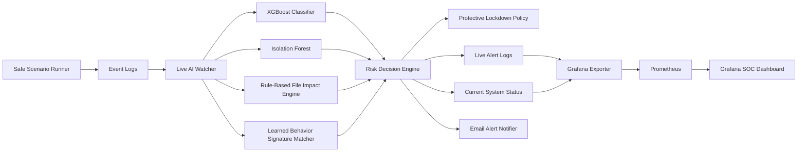
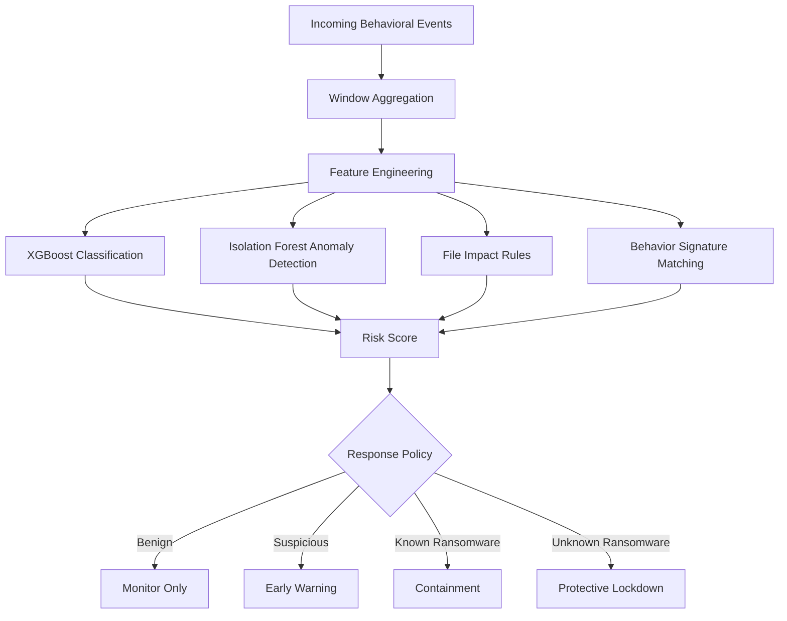

# Ransomware AI Detection and Adaptive Response System

> AI-based continuous behavioral monitoring, ransomware symptom detection, adaptive learning, and SOC-style response simulation.


---

## Overview

This project is a safe ransomware detection and response prototype designed for academic research and cybersecurity demonstration purposes.

The system continuously monitors simulated behavioral events, extracts ransomware-related symptoms, classifies suspicious activity using machine learning models, detects unknown patterns using anomaly detection, and triggers protective response policies.

The project focuses on behavioral indicators such as:

* Rapid file modification activity
* Suspicious file extension changes
* High-impact file operations
* Abnormal process and registry behavior
* Unusual event sequences
* Unknown ransomware-like behavior
* Simulated multi-host file impact

The system does **not** execute real ransomware samples. All ransomware behaviors are reproduced through safe event simulation and sandbox logs.

---

## Key Features

* Continuous event monitoring from simulated enterprise logs
* Behavioral ransomware detection using machine learning
* XGBoost-based primary classification
* Random Forest baseline model
* Isolation Forest anomaly detection for unknown behavior
* Rule-based file impact detection
* Adaptive learning from missed detection scenarios
* Learned behavior signature matching
* FastAPI prediction service
* Grafana SOC dashboard
* Prometheus metrics exporter
* Email alert notification
* Protective lockdown simulation
* MITRE ATT&CK behavior mapping
* Safe ransomware scenario runner

---

## System Architecture



---

## Detection Pipeline



---

## AI Models

### 1. XGBoost Classifier

The main supervised learning model is XGBoost.

It predicts whether a behavioral window is:

```text
benign
known_ransomware_like
suspicious_behavior
```

Example output:

```text
Predicted Label: known_ransomware_like
Risk Score: 0.93
Policy: containment
```

---

### 2. Random Forest Baseline

Random Forest is used as a baseline model for comparison.

It helps evaluate whether the XGBoost model provides better performance for behavioral ransomware detection.

---

### 3. Isolation Forest

Isolation Forest is used to detect unknown or unusual behavioral patterns.

This is useful for simulated zero-day ransomware behavior where the pattern may not exist in the supervised training dataset.

Example:

```text
Known Model Prediction: benign
Anomaly Detection: high
File Impact: true
Final Policy: protective_lockdown
```

---

### 4. Rule-Based File Impact Detection

The system also includes rule-based detection for high-impact ransomware symptoms.

Examples include:

```text
large number of file modifications
file extension changes
creation of ransom note indicators
high impact events across multiple hosts
suspicious file locking behavior
```

This helps prevent missed detections when the ML model produces a low-risk prediction.

---

### 5. Adaptive Learning and Signature Matching

When the system observes a missed ransomware-like attack with confirmed file impact, it can save the behavior pattern as a learned signature.

On the next similar attack:

```text
Scenario Run 1:
Unknown ransomware behavior
Model prediction: benign
File impact detected
Learning signature created

Scenario Run 2:
Same behavior appears again
Learned signature matched
System predicts learned_unknown_ransomware
Protective lockdown triggered
```

---

## Project Structure

```text
Ransomware_AI_Dectection/
│
├── src/
│   └── symptom_ai/
│       ├── api/
│       │   └── main.py
│       │
│       ├── auto_learning/
│       │   └── auto_retraining_pipeline.py
│       │
│       ├── dataset_ingestion/
│       │   ├── build_unified_symptom_dataset.py
│       │   ├── ingest_all_available_datasets.py
│       │   ├── parser_csu_ransomware.py
│       │   └── parser_ransomset.py
│       │
│       ├── explainability/
│       │   └── evidence_matcher.py
│       │
│       ├── live_monitoring/
│       │   ├── live_log_ai_watcher.py
│       │   ├── demo_scenario_runner.py
│       │   ├── email_alert_notifier.py
│       │   ├── grafana_prometheus_exporter.py
│       │   └── safe_event_generator.py
│       │
│       ├── models/
│       │   ├── train_symptom_models.py
│       │   ├── predict_symptom_case.py
│       │   ├── build_training_reference.py
│       │   └── risk_scorer.py
│       │
│       ├── response_engine/
│       │   └── protective_lockdown.py
│       │
│       ├── sandbox/
│       │   └── replay_mlran_cic_sandbox.py
│       │
│       └── simulation/
│           └── safe_progressive_ransomware_sim.py
│
├── monitoring/
│   ├── docker-compose.yml
│   ├── prometheus/
│   │   └── prometheus.yml
│   └── grafana/
│       └── ransomware_ai_dashboard.json
│
├── data/
│   └── raw/
│       └── dataset_registry.json
│
├── check_demo_result.sh
├── reset_dashboard_only.sh
├── requirements.txt
├── .env.example
└── .gitignore
```

---

## Dataset Strategy

The project uses a unified behavioral symptom dataset built from multiple ransomware and malware-related sources.

The dataset integration focuses on normalized behavioral features such as:

```text
file activity
process activity
registry activity
API call behavior
entropy-related behavior
network-related behavior
system event activity
ransomware impact indicators
```

Raw datasets are not included in this repository because of size, licensing, and security considerations.

Dataset configuration is stored in:

```text
data/raw/dataset_registry.json
```

---

## Installation

Clone the repository:

```bash
git clone https://github.com/Wolfsenpai123/Ransomware_AI_Dectection.git
cd Ransomware_AI_Dectection
```

Create a Python virtual environment:

```bash
python3 -m venv venv
source venv/bin/activate
```

Install dependencies:

```bash
pip install -r requirements.txt
```

---

## Run the FastAPI Service

```bash
source venv/bin/activate

PYTHONPATH=src uvicorn symptom_ai.api.main:app \
  --host 0.0.0.0 \
  --port 8000 \
  --reload
```

API endpoint:

```text
http://127.0.0.1:8000
```

Swagger documentation:

```text
http://127.0.0.1:8000/docs
```

---

## Run the Live AI Watcher

```bash
source venv/bin/activate

PYTHONPATH=src python src/symptom_ai/live_monitoring/live_log_ai_watcher.py \
  --window-events 20 \
  --poll 1 \
  --reset-offset
```

The watcher continuously reads behavioral events and produces:

```text
current_status.json
live_alerts.jsonl
STOP_SIGNAL.json
learned_behavior_signatures.json
```

---

## Run Grafana and Prometheus

```bash
cd monitoring
docker compose up -d
```

Grafana dashboard:

```text
http://localhost:3000
```

Prometheus:

```text
http://localhost:9090
```

Run the Prometheus exporter:

```bash
PYTHONPATH=src python src/symptom_ai/live_monitoring/grafana_prometheus_exporter.py \
  --port 9108 \
  --poll 1
```

---

## Email Alert Configuration

Create a local `.env` file based on `.env.example`.

```bash
cp .env.example .env
```

Example configuration:

```text
EMAIL_DRY_RUN=1

SMTP_HOST=smtp.gmail.com
SMTP_PORT=587
SMTP_USER=your_alert_sender@gmail.com
SMTP_PASSWORD=your_gmail_app_password

EMAIL_FROM=your_alert_sender@gmail.com
EMAIL_TO=your_receiver@gmail.com
```

Run the email notifier:

```bash
PYTHONPATH=src python src/symptom_ai/live_monitoring/email_alert_notifier.py \
  --poll 0.25 \
  --alert-interval 1
```

Never upload `.env`, Gmail App Passwords, API keys, tokens, or personal email credentials to GitHub.

---

## Demo Scenarios

The system supports safe simulated ransomware scenarios.

### Scenario 1: Benign Activity

```text
Expected Result:
Policy: monitor_only
Risk: low
File Impact: false
STOP_SIGNAL: not created
```

### Scenario 2: Suspicious Activity

```text
Expected Result:
Policy: early_warning
Risk: medium
File Impact: false
```

### Scenario 3: Known Ransomware Behavior

```text
Expected Result:
Predicted: known_ransomware_like
Policy: containment
STOP_SIGNAL: created
```

### Scenario 4: Novel Zero-Day Ransomware Behavior

First execution:

```text
Predicted: benign or suspicious
File Impact: true
Learning Case: created
Learned Signature: saved
```

Second execution:

```text
Predicted: learned_unknown_ransomware
Learned Match: true
Policy: protective_lockdown
STOP_SIGNAL: created
```

---

## Protective Lockdown

When a high-risk ransomware event is detected, the system can simulate a protective response.

Examples include:

```text
create STOP_SIGNAL
record affected hosts
record high-impact events
trigger SOC dashboard alert
trigger email notification
save learning signature
```

This project does not perform real host isolation, network blocking, process killing, or destructive system actions.

---

## MITRE ATT&CK Mapping

The system can map simulated ransomware behavior to MITRE ATT&CK techniques.

Example techniques:

```text
T1486 - Data Encrypted for Impact
T1490 - Inhibit System Recovery
T1059 - Command and Scripting Interpreter
T1070 - Indicator Removal
T1027 - Obfuscated Files or Information
```

---

## Security and Safety Disclaimer

This repository is created strictly for educational, research, and defensive cybersecurity purposes.

The repository does not contain:

```text
real ransomware binaries
malicious executable files
password-protected malware archives
stolen data
real victim logs
ransomware source code
credential files
Gmail app passwords
API keys
```

All ransomware behaviors are simulated through safe event generation, logs, sandbox scenarios, and controlled file impact demonstrations.

---

## Limitations

* The system currently uses simulated and normalized behavioral logs.
* Detection performance depends on training data quality.
* Unknown ransomware detection may still produce false positives.
* The protective lockdown is a safe simulation rather than real endpoint isolation.
* Raw datasets and trained model artifacts are intentionally excluded from GitHub.

---

## Future Improvements

* Real SIEM integration
* Wazuh integration
* Sysmon event ingestion
* Elastic Stack integration
* Automated model retraining
* Better explainability dashboards
* Multi-host attack correlation
* More ransomware family behavior profiles
* Improved zero-day anomaly detection
* Real SOC incident workflow integration

---

## Authors

Academic cybersecurity research project.

Repository:

```text
https://github.com/Wolfsenpai123/Ransomware_AI_Dectection
```

---

## License

This project is intended for academic and research purposes only.
